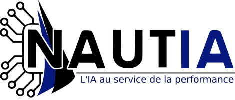

# Reinforcement Learning for Foiling Sailboats

<div align="center">
  
  
</div>

<br/>

> **"Assigning the helm to neural networks trained to optimize the boat's trajectory."**

## 🌊 Overview

**DeepSkipper** is a Deep Reinforcement Learning (DRL) project developed in the context of the **SMART-DATA (2025-2026)** specialization at **ENSAI**, in collaboration with the startup **Nautia**.

Racing boats, particularly those in solo round-the-world races like the *Vendée Globe*, rely on high-performance autopilots. However, traditional closed-loop control systems often fail to optimize trajectories fully, forcing sailors to steer manually to remain competitive.

With the advent of **foils**—underwater wings that lift the hull to reduce drag—new steering strategies are required. This project aims to train neural networks (PPO agents) capable of mastering these dynamics to optimize speed and stability under varying environmental conditions.

## 🚀 Features

* **Algorithms:** Proximal Policy Optimization (PPO) via `Stable-Baselines3`.
* **Architectures:**
    * **MLP Policy:** Standard feed-forward network for state-based control.
    * **1D-CNN:** Custom `HistoryCNNExtractor` to process temporal sequences of wind and boat states.
* **Simulation:** Custom parallelized environment (`NonDaemonicSubprocVecEnv`) wrapping the **Nautia** simulator.
* **Custom Rewards:** Velocity Made Good (VMG) optimization with out-of-bounds penalties.

## 🛠️ Installation

1.  **Clone the repository:**
    ```bash
    git clone [https://github.com/your-username/DeepSkipper.git](https://github.com/your-username/DeepSkipper.git)
    cd DeepSkipper
    ```

2.  **Install dependencies:**
    ```bash
    pip install -r requirements.txt
    ```
    *Note: This project requires the private `boatsgym` and `boatsimulator` packages provided by Nautia.*

## 🏃 Usage

### Training
To train the agent using the configuration defined in `config/train.json`:

**Standard MLP Agent:**
```bash
python src/train_mlp.py