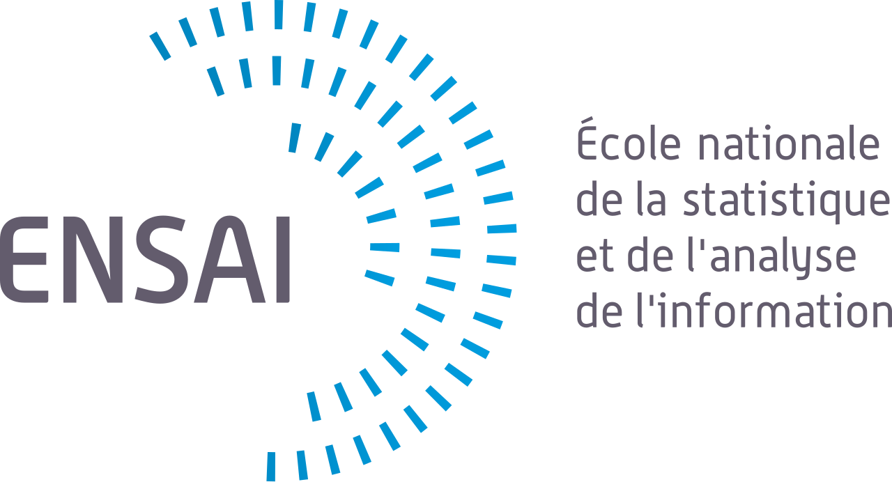
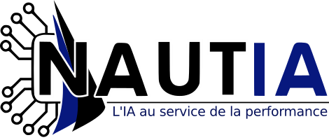

### Reinforcement Learning of a Steering Model for a Foiling Sailboat

<div align="center">
  
  
</div>

<br/>

This Deep Reinforcement Learning (DRL) project developed during the SMART-DATA (2025–2026) specialization at **ENSAI**, in collaboration with the [Nautia](https://nautia.fr/). 

#### Rationale

Racing sailboats competing in elite solo offshore events such as the [Vendée Globe](https://en.wikipedia.org/wiki/Vend%C3%A9e_Globe) rely heavily on high-performance autopilot systems to maintain optimal performance over long distances. However, traditional closed-loop control approaches often struggle to optimize trajectories under stochastic and rapidly changing environmental conditions, frequently requiring manual intervention from sailors to remain competitive. This project introduces a Deep Reinforcement Learning (DRL) framework designed to learn optimal steering policies within a custom Gymnasium-based sailing simulator. The control problem is formulated as a Markov Decision Process (MDP), focusing on upwind navigation across varying wind headings (90°–140°) and wind speeds (10–18 knots). Three control strategies are evaluated: a classical PID baseline, a native Multi-Layer Perceptron (MLP) policy using the Stable-Baselines3 default architecture, and a novel 1D Convolutional Neural Network (CNN) feature extractor. Results demonstrate that the 1D CNN achieves the strongest overall performance, reaching a peak Course Made Good (CMG) of **24.59 knots** under stress-test conditions (95° heading, 20 kts wind) and outperforming the PID controller in most in-distribution scenarios with improvements of up to **+5.27%**. While the MLP exhibited instability in high-wind regimes and often underperformed relative to the PID baseline, the 1D CNN proved to be the most robust architecture for high-speed foiling, despite some vulnerability to out-of-bounds failures under light-wind conditions (10 kts).

The agent maximises Course Made Good (CMG), the projected boat speed along the target heading  with an out-of-bounds penalty when the relative heading exceeds ±45°:

$$r_t = \text{CMG}_t - \mathbb{1}\left[|\Delta\theta| \geq 45°\right] \cdot c_{\text{oob}}$$


> 📄 **Paper:** [Read the full report](Report/main.pdf)

Project Structure

```
deep-fooling/
├── cnn_extractor.py               # 1D CNN feature extractor (HistoryCNNExtractor)
├── minimal_train_1dcnn_par_seed.py # Training script — 1D CNN policy (parallel, seeded)
├── minimal_train_par_seed.py       # Training script — MLP policy (parallel, seeded)
├── parallel_env.py                 # Non-daemonic SubprocVecEnv for parallel envs
├── rewards.py                      # CMG-based reward function
├── event.py                        # Event definitions
├── environment.json                # Evaluation environment configuration
├── train.json                      # Training environment configuration
├── notebooks/
│   ├── plots.ipynb                 # Visualisation & analysis notebook
│   ├── 1DCNN/                      # 1D CNN evaluation CSVs
│   ├── MLP/                        # MLP evaluation CSVs
│   └── Baseline/                   # PID baseline evaluation CSVs
├── TEST/                           # Testing & evaluation scripts
├── Report/                         # LaTeX source for the paper
└── assets/                         # Logos and images
```


### 1D CNN Feature Extractor

The custom `HistoryCNNExtractor` reshapes stacked observations into a temporal sequence and applies two 1D convolution layers, allowing the policy to extract short-term temporal patterns from wind fluctuations:

```
Input (flat) → Reshape (stack × features) → Conv1D(32) → ReLU → Conv1D(64) → ReLU → Flatten → Linear(64)
```

###### Training

- **Algorithm:** PPO (Proximal Policy Optimization) via [Stable-Baselines3](https://stable-baselines3.readthedocs.io/)
- **Observation stacking:** `VecFrameStack` (3 frames)
- **Normalisation:** `VecNormalize`
- **Parallelism:** Custom `NonDaemonicSubprocVecEnv` for multi-process rollout collection
- **Learning rate:** Linear schedule with configurable initial and final values
- **Timesteps:** 250,000


Evaluation

Evaluation scripts are located in the `TEST/` directory. See `TEST/evaluate_1dcnn.py` and `TEST/evaluate_mlp.py`.

Acknowledgements

This project was developed at **ENSAI** as part of the SMART-DATA specialization (2025–2026), in partnership with **Nautia**.
